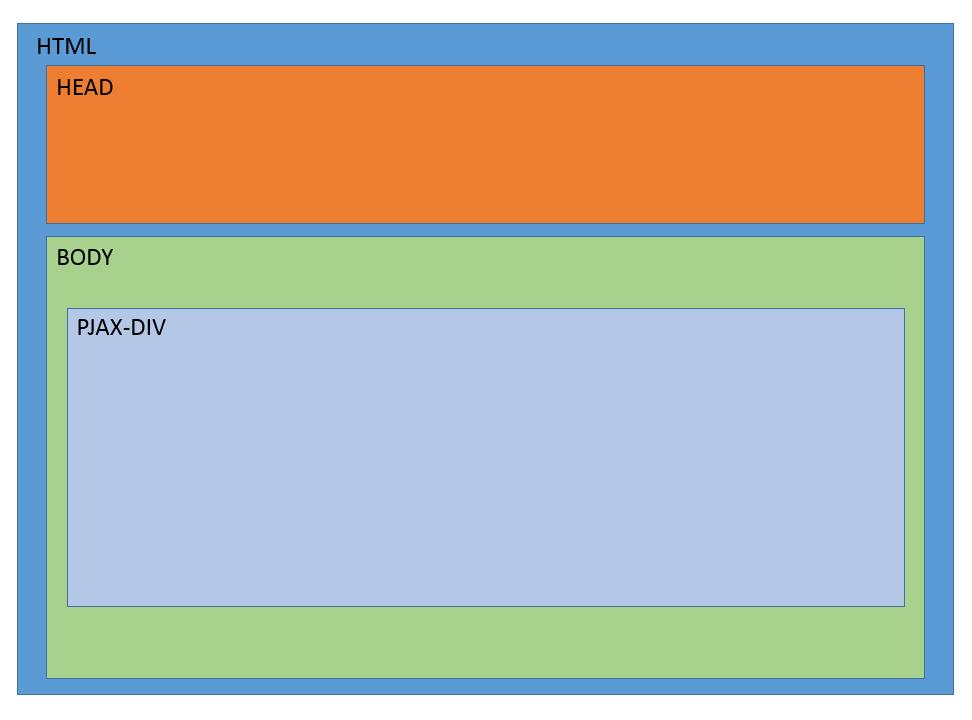

# 背景
最近接触了一些比较使用的单页面解决方案，有```turbolinks```，```jquery-pjax```，```vue-router```，```riot-router```等。

其中 ```turbolinks``` 和 ```jquery-pjax``` 都是站点级的解决方案，对于开发单页面站点，非常便利，但是也挺多不友好的地方，如:

* 对外部脚本支持不友好，加载顺序不能得到保证
* 页面跳转时，对动画支持不友好
* 需要服务端配置，对页面内容进行整改

而 ```vue-router``` 和 ```riot-router``` 与对应的框架耦合非常严重，不能独立使用。
除了动画切换比较友好，缺点也很值得吐槽:

* 把全部地址，配置为路由规则，总有一种前端开发全站的感觉
* 除了数据外，全站真的是前端组件开发的啊..
* 需要自己管理对应路由，需要运行的逻辑、加载的资源

所以，最后的最后，为了一劳永逸，就有了这个方案。
总体上，还是参考了 ```turbolinks``` 和 ```jquery-pjax``` 此两个方案。

# 优势

* 允许动画
* 有顺序的脚本加载
* 不用刻意配置路由
* 允许子路由配置
* 除了链接地址，其余全部由前端控制


# 介绍
为了不浪费脑力，此项目脚本，也叫```pjax```，省事，没烦恼。

使用 ```pjax```，会把每个页面，都分为3个板块，如图所示:



## head 标签区域
head 标签里的所有资源[script/link/style 标签]，每次 pjax 加载时，默认都会根据当前标签的 src 或 href，检查当前页面，是否已经存在该资源，如果该资源不存在，则会加载该资源。

注: style 标签，因为没有 href 或 src，所以每次 pjax 都会插入该标签的内容，所以应该避免在 head 标签内，使用 style 标签。

## body 标签区域
 1. 父层为 body 的 外部 script 和 link，默认进行 once 模式的加载，资源将插入到 head 中
 * 父层不是 body 的外部 script 和 link，默认都是 ignore，忽略加载的，可以通过设置 ```data-pjax-res``` 标志，让 pjax 加载此资源
 * 父层为 body 的 内联 script 和 style，默认都是进行 repeat 模式的加载
 * 父层不是 body 的 内联 script 和 style，模式都是 ignore，忽略加载的，可以通过设置 ```data-pjax-res``` 标志，让 pjax 加载此资源。内联资源，仅识别 repeat 和 ignore
 * 所有加载模式为 repeat，或者联资资源[inline script 或 style]，都将插入到 container 中
 * 所有加载模式为 once 的资源，都将插入到 head 中

## pjax-div 标签区域
  1. 所有 script/link/style 标签，默认使用 repeat 加载
  * 可通过设置 data-pjax-res 标志，更改加载方式
  * body 内，所有 pjax 加载回来的内联脚本，或内联样式，或设置了 data-pjax-res=repeat 标志的资源，都将插入到 pjax-div 中

注: 每个页面，只允许存在一个 pjax-div 标签

## 例子
```html
<html>
<head>
  <!-- 自动判定，当前脚本和样式，是否已经被加载过了，如果加载过了，就不再加载 -->
  <link href="" />
  <script src=""></script>
  <script>
    // 每次异步之后，都会在 head 中，插入此脚本，所以head中尽量避免使用 script 标签
    // 如果一定要使用，请配合 data-pjax=ignore 使用
  </script>
  <style>
    /* 每次异步之后，都会在 head 中插入此样式，所以head中尽量避免使用 style 标签 */
  </style>
</head>
<body>

  <!--
    每个页面，只允许有1个 data-pjax-container
    内部的所有资源，默认都是 data-pjax-res="repeat" 的
  -->
  <div data-pjax-container>
    异步的内容
    <script>每次被异步回来时，都会执行的脚本 或 外部脚本</script>
    <link href="每次异步回来时，都会加载的样式" rel="stylesheet" />
    <style>
      /* 每次异步回来时，都会加载的样式 */
    </style>
    <style data-pjax-res="ignore">
      /* 有 data-pjax-res=ignore 属性，每次异步回来时，都会忽略此样式 */
    </style>
    <!-- 加载一次后，忽略重复的 -->
    <link href="" rel="" data-pjax-res="once" />
  </div>

  <!-- 在 body 最外层的所有外部脚本、外部样式，默认都是 data-pjax-res=once的 -->
  <script src=""></script>
  <link href="" rel="stylesheet" />

  <!-- 在 body 最外层的所有内联脚本、内联样式，默认事都 data-pjax-res=repeat 的 -->
  <style>
    /* 每次异步加载，都会插入到 container 中 */
  </style>
  <script>
    /* 每次异步加载，都会插入到 container 中 */
  </script>

  <!-- 有 data-pjax-res="once" 或 没有值 标志的元素，异步时，仅加载一次 -->
  <script src="" data-pjax-res="once"></script>
  <!-- 有 data-pjax-res="repeat" 标志的元素，每次异步都会进行加载，而且将插入到 container 中 -->
  <script src="" data-pjax-res="repeat"></script>

  <div>
    <!-- 不在 body 最外层，默认是 data-res-pjax=ignore -->
    <script src=""></script>
    <!-- 根据 data-pjax-res=repeat，内容将插入到 container 中 -->
    <script src="" data-pjax-res="repeat"></script>
    <!-- 根据 data-pjax-res=once，内容将插入到 head 中 -->
    <script src="" data-pjax-res="once"></script>
  </div>
</body>
</html>
```

# 使用
```javascript
  var pjax = $.pjax($('#main'), {
    // 每个 $.pjax 实例，必须有唯一的 key 值，默认是 pjax
    // 此 key，用来组装当前实例使用的属性
    key: 'pjax',
    // 请求是否使用缓存？
    cache: true,
    // 页面前端，运行动画需要的时间。
    // 如果没有动画要求，请设置为 0
    animateTime: 300,
    // 是否触发初始话的 dom:ready 和 pjax:render 事件？
    fireInitEvent: true,

    // 资源加载默认配置
    resourceLoadConfig: {
      // 在 body 最外层的资源
      body: { /* inlineScript: repeat, script: once, style: repeat, link: once */ },
      // 在 head 的资源
      head: { /* inlineScript: repeat, script: once, style: repeat, link: once */ },
      // 在 container 内的资源
      container: { /* inlineScript: repeat, script: repeat, style: repeat, link: repeat */ },
      // 在 body 内，但不是最外层的资源
      other: { /* inlineScript: ignore, script: ignore, style: ignore, link: ignore*/ }
    }
  });

  // 有以下几个方法:
  pjax.push(带 href 的 a 标签，或 uri 链接, isCache);    // 类似 location.href = url
  pjax.replace(带 href 的 a 标签，或 uri 链接, isCache); // 类似 location.replace
  pjax.back();    // 后退
  pjax.forward(); // 前进
  pjax.reload(url?, isCache);  // 刷新，如果有 url 参数，则异步请求 url 参数

  pjax.on('事件名', 回调函数); // 同理，有 off/fire/one 几个函数，参考 jQuery 事件

  $.pjax.support // 当前浏览器，是否支持 $.pjax，如果当前浏览器不支持 $.pjax，也会至少抛出 dom:ready 事件的
```
其中 ```$('#main')``` 是当前页面主体内容、$.pjax 请求的内容，应该放置的容器。

## key 属性
假设初始化如下:
```javascript
  var pjax = $.pjax($('#main'), { key: 'pjax2' });
```
对应的 pjax div 应该设置为:
```html
<div data-pjax2-container>
  内容
</div>
```
下面介绍的所有属性、类名，都是以此类推。

## dom属性
所有属性，都是这个形式，组成的: ```data-[key参数]-xxx```

### data-[key]-container
指定当前页面，$.pjax 请求的主体内容，如:
```html
  <!-- page/list.html key: pjax-->
  <div data-pjax-container>
    <ul>
      <li>1</li>
      <li>2</li>
    </ul>
  </div>
```
$.pjax 请求 ```page/list.html``` 时，将会把 ```<div><ul>...</ul></div>``` 整块 html 内容，插入到 ```$('#main')``` 中。

### data-[key]-ignore
有此属性的资源，无论放置在哪个板块，在 $.pjax 请求中，会忽略该资源、标签的加载。普通的请求，不受影响。

### data-[key]-res
拥有此属性的资源，在 $.pjax 请求中，进行加载。
```javascript
  data-pjax-res="0" // 如果资源已经存在，忽略，否则加载
  data-pjax-res="1" // 无论资源是否存在，都加载
```

## 事件

1. pjax:request 请求新页面
- pjax:complete 请求完成
- pjax:success 请求完成
- pjax:failure 请求失败
- pjax:parseerror ajax返回的内容，结构解析失败，产生此错误，会中断 dom 事件
- pjax:render 某个 dom 元素，所有脚本已经加载完毕，并且 dom 元素已经显示
- dom:ready 某个 dom 元素，所有脚本已经加载完毕，并且 dom 元素已经显示
- dom:beforeshow 某个 dom 元素，显示之前
- dom:beforehide 某个 dom 元素，隐藏之前
- dom:show 某个 dom 元素，显示
- dom:hide 某个 dom 元素，隐藏
- dom:destroy 某个 dom 元素，销毁

事件执行顺序如下:
pjax:request -> pjax:complete -> pjax:success|pjax:failure -> dom:beforeshow -> dom:beforehide -> dom:show -> dom:hide -> pjax:render -> dom:ready


## 动画钩子类

每次都会有两个元素，同时进行处理，分别为 $hide 和 $show。

切换时，会进入以下流程:
```javascript
$hide.addClass('pjax-before-hide [key]-[action]-before-hide [key]-before-hide');
$show.addClass('pjax-before-show [key]-[action]-before-show [key]-before-show');
$hide.addClass('pjax-hide [key]-[action]-hide [key]-hide');
$show.addClass('pjax-show [key]-[action]-show [key]-show');
```

其中，key 为 $.pjax 中传入的参数，action 有: replace/push/back/forward，可以按照上述流程，灵活编写动画


# 测试
全局安装 ```npm install http-server -gd``` 后，运行 ```http-server -p 8080```，然后访问 ```http://localhost:8080/index.html```查看效果
